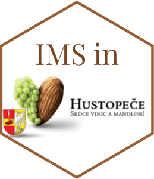

# Software for Reproducible Research 

```{r setup, include=FALSE}
knitr::opts_chunk$set(echo = TRUE)
```

**Repository for [IMS](https://cemsiis.meduniwien.ac.at/ms/)-RETREAT 2022**

This website contains examples and references for the creation of packages, interactive documents and web pages to facilitate reproducibility of analysis and distribution of materials among peers.

## General tricks and toolkit 

- **IMS-repository** of useful programming functions. Toolkit by Teresa Engelbrecht

## Package Development

- Vignette how to create an R package and toy example
- **IMS-example**: CohortPlat by Elias Meyer: https://github.com/el-meyer/CohortPlat

## R-markdown

- Vignette: How to create a markdown document, and where to find some templates
- **IMS-examples**:
  - R-markdown tips and tricks by Jonas Brugger
  - Re-analysis template by Jonas Brugger

## Github websites

- Vignette how to create a website and toy example
- **IMS-example**: NCC by Pavla Krotka: https://pavlakrotka.github.io/NCC/


## References 

- Package development with devtools cheatsheet: https://raw.githubusercontent.com/rstudio/cheatsheets/main/package-development.pdf
- Hadley's book on package development: https://r-pkgs.org/
- R-markdown: https://tysonbarrett.com/Rstats/chapter-9-reproducible-workflow-with-rmarkdown.html
- References for websites: Hadley's book on package development: https://r-pkgs.org/
