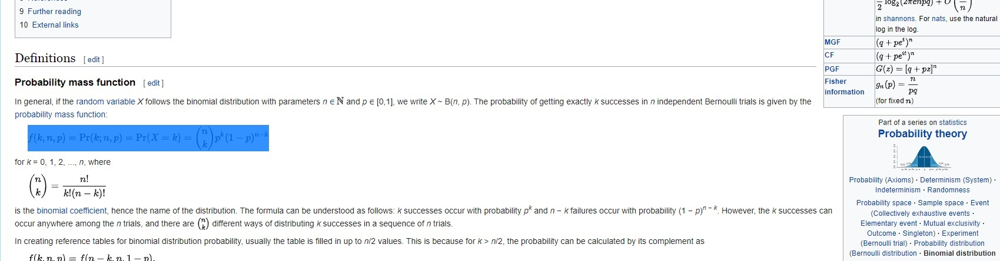
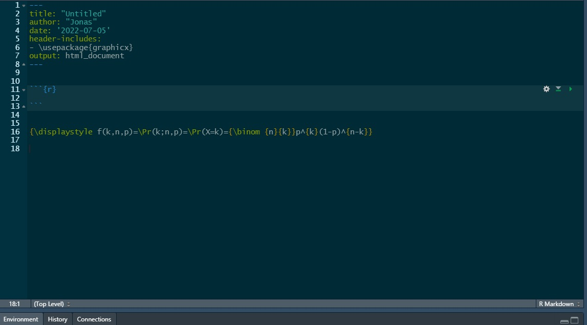
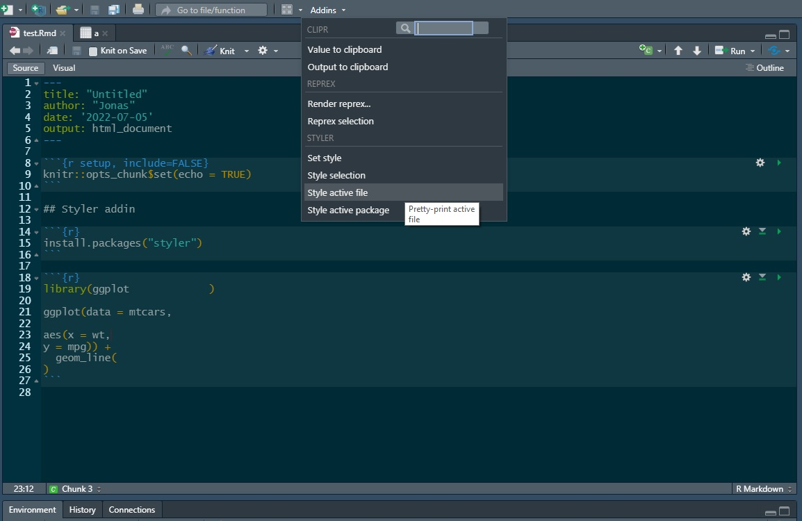
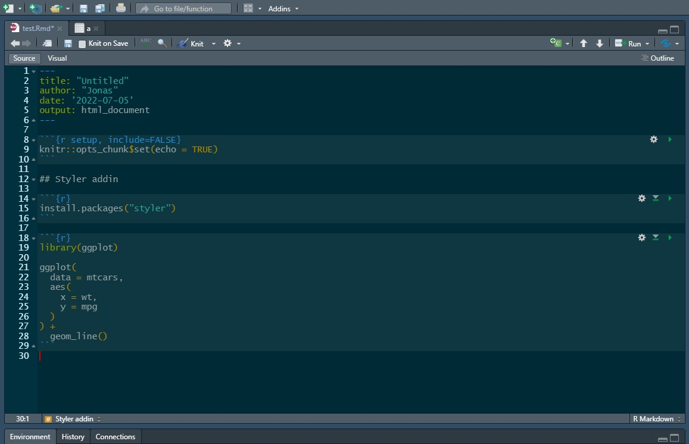
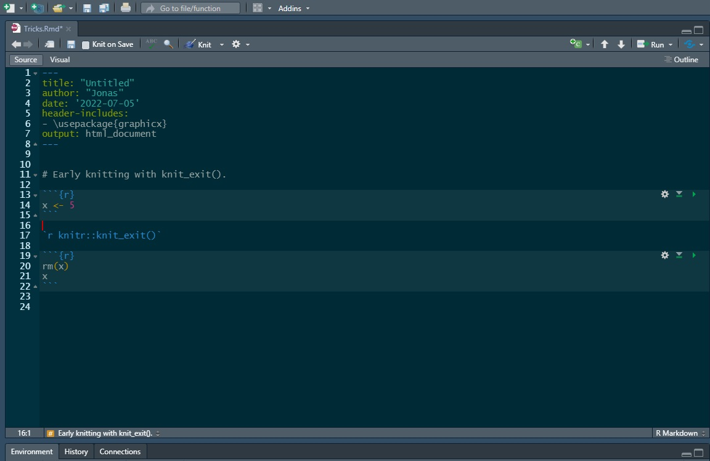

## Drag and drop formulas from Wikipedia








${\displaystyle f(k,n,p)=\Pr(k;n,p)=\Pr(X=k)={\binom {n}{k}}p^{k}(1-p)^{n-k}}$


## Styler addin








## Write text in chunks with knit_expand()


```{r}
x <- 5
```

```{r}
knitr::knit_expand(text = "x equals {{x}}.")
```

```{r, results='asis'}
cat(knitr::knit_expand(text = "x equals {{x}}."))
```


## Early knitting with knit_exit().




```{r}
x <- 5
```

`r knitr::knit_exit()`

```{r}
rm(x)
x
```

